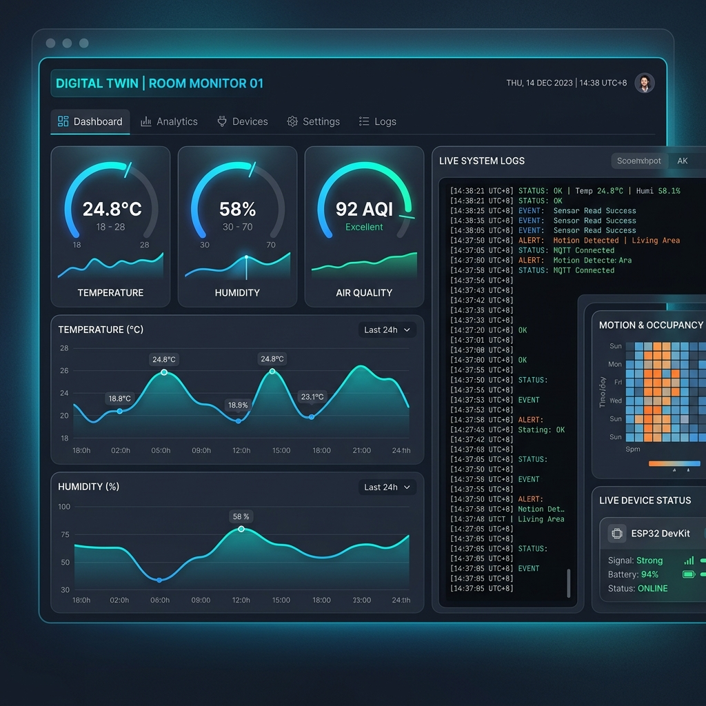
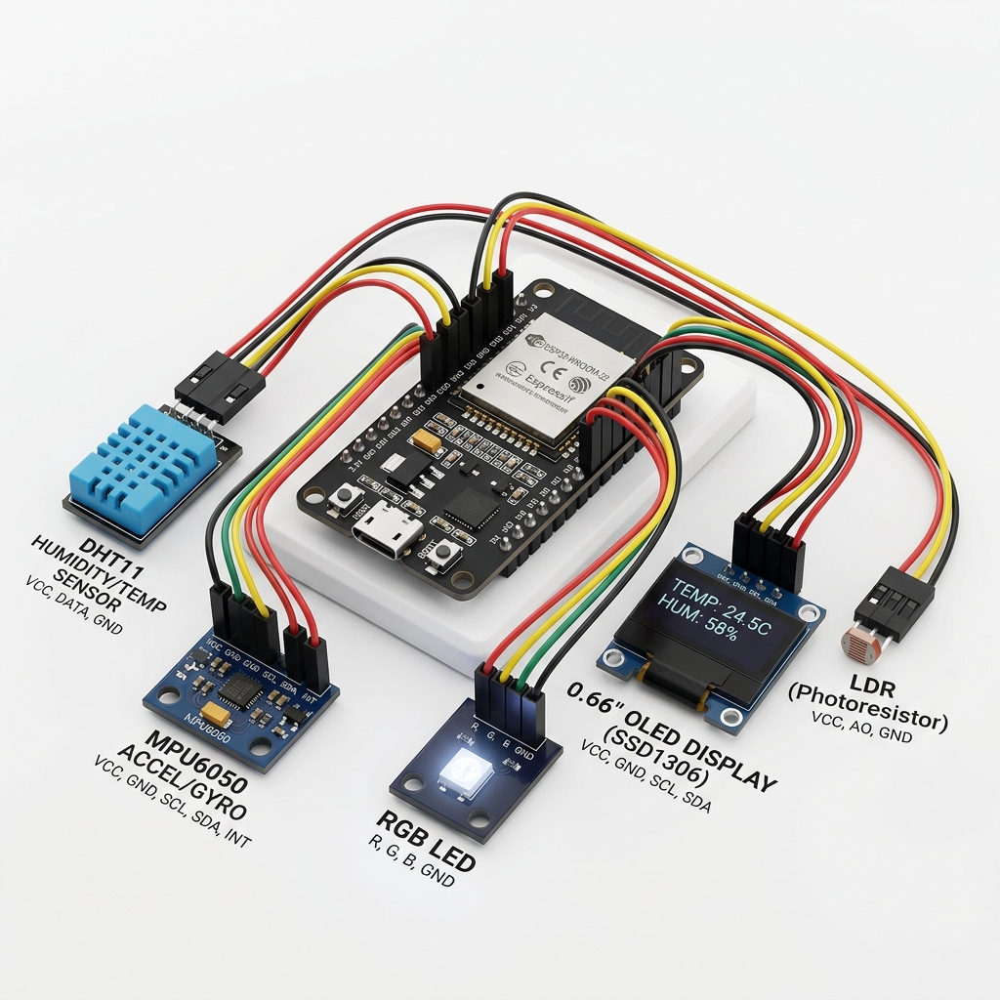

# AETHER_OS | Next-Gen ESP32 Room Monitor



**AETHER_OS** is a high-performance, energy-efficient "Digital Twin" IoT monitoring system. Built on a FreeRTOS-driven ESP32 firmware and a modern Next.js dashboard, it provides real-time environmental telemetry with professional-grade analytics and remote system logging.

## 🚀 Core Features

### 📡 Intelligent Firmware (v2.1)
- **FreeRTOS Architecture**: Multithreaded execution on Core 1 for stable concurrent operations.
- **Deep Sleep Optimization**: Advanced power management with 5-minute cycles and manual wake-up support (GPIO 33).
- **Multi-Sensor Array**: Precision sampling from DHT11 (Temp/Hum), MPU6050 (Motion), and LDR (Light).
- **Dynamic OLED UI**: 0.66" SSD1306 display featuring a hardware reset sequence and real-time status framing.
- **Creative Visuals**: Multi-color LED "Life Cycle" indicators (Pulse Blue for Wake, Rainbow for Sampling, Cyan for WiFi).

### 📊 Professional Dashboard
- **Real-time Synchronization**: Built with Next.js and Supabase for sub-second data updates.
- **Trend Analysis**: Interactive multi-sensor charts with timeframe toggling (24H, 7D, 30D, 1Y).
- **Singapore-Local Terminal**: A live "System Log" terminal showing raw data collection steps with UTC+8 timestamps.
- **Glassmorphism UI**: A premium, dark-mode design optimized for both desktop and mobile command centers.

## 🛠️ Hardware Architecture



| Component | Pin (ESP32) | Role |
| :--- | :--- | :--- |
| **DHT11** | GPIO 4 | Temperature & Humidity |
| **LDR** | GPIO 34 | Ambient Light Sensing |
| **MPU6050** | GPIO 21/22 | 6-Axis Motion Detection |
| **OLED (SSD1306)** | I2C + GPIO 16 | System UI & Local Debug |
| **RGB LED** | GPIO 13, 14, 27 | Visual Status Feedback |
| **Manual Trigger** | GPIO 33 | Instant Data Uplink |

## 🏗️ Technical Stack
- **Firmware**: C++ / Arduino Framework / FreeRTOS (PlatformIO)
- **Frontend**: Next.js 14 / Tailwind CSS / Recharts / Framer Motion
- **Backend**: Supabase (PostgreSQL + Realtime Engine)
- **Communication**: Secure WiFi Client (TLS/SSL) via HTTPS REST API

## 📖 Deployment Guide

### Firmware Setup
1. Open the `firmware/` folder in VS Code with PlatformIO.
2. Update `secrets.h` with your WiFi and Supabase credentials.
3. Flash to ESP32: `pio run -t upload`.

### Dashboard Setup
1. Navigate to the `dashboard/` folder.
2. Install dependencies: `npm install`.
3. Set environment variables:
   ```env
   NEXT_PUBLIC_SUPABASE_URL=your_url
   NEXT_PUBLIC_SUPABASE_ANON_KEY=your_key
   ```
4. Run locally: `npm run dev`.

---
*Developed for a stable, high-performance "Digital Twin" experience.*
