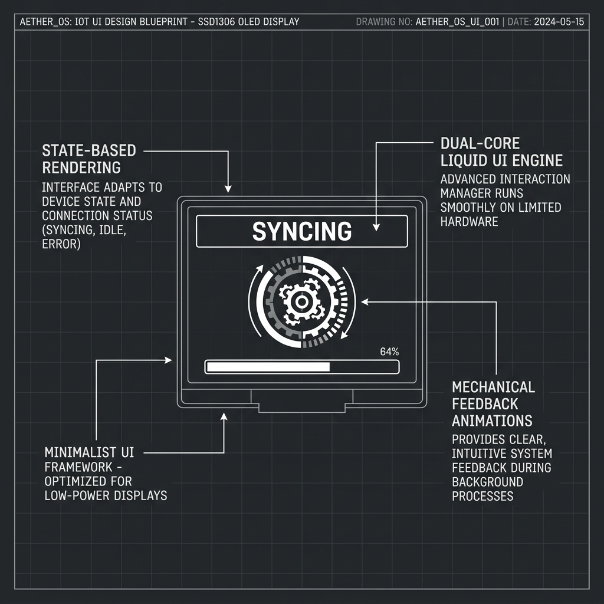
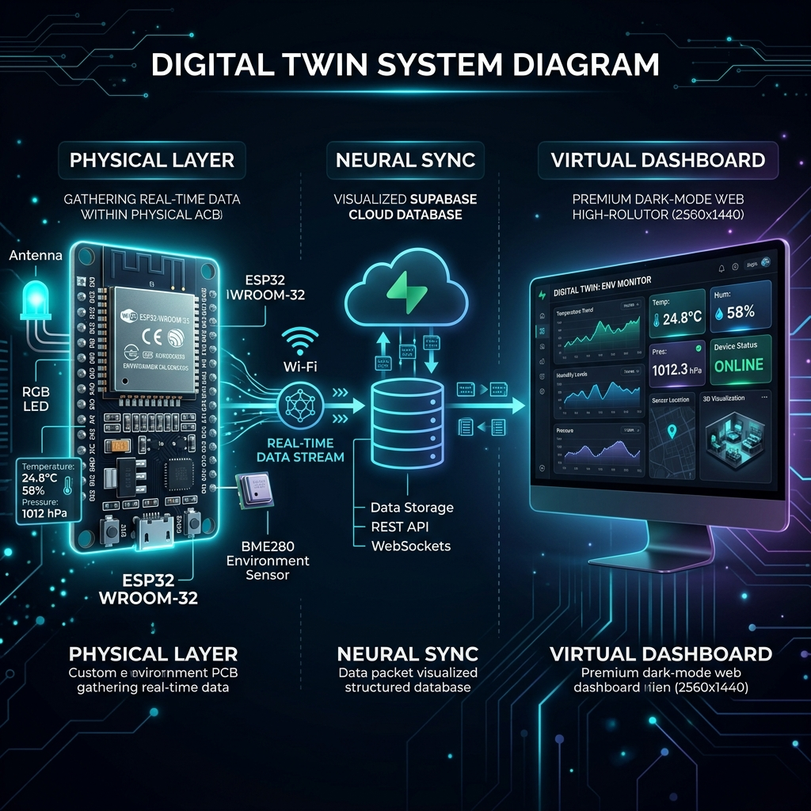
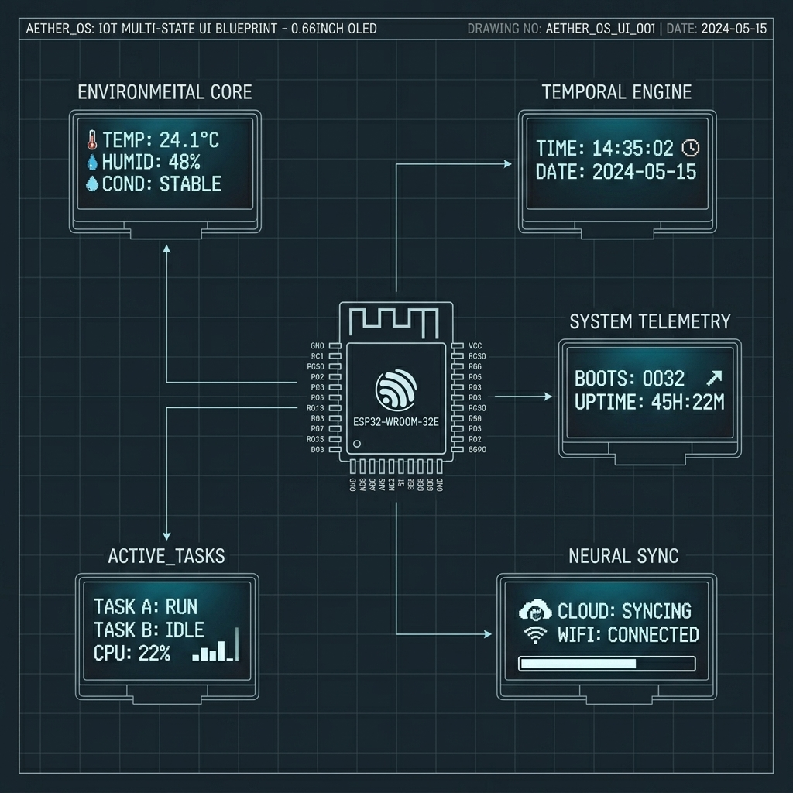
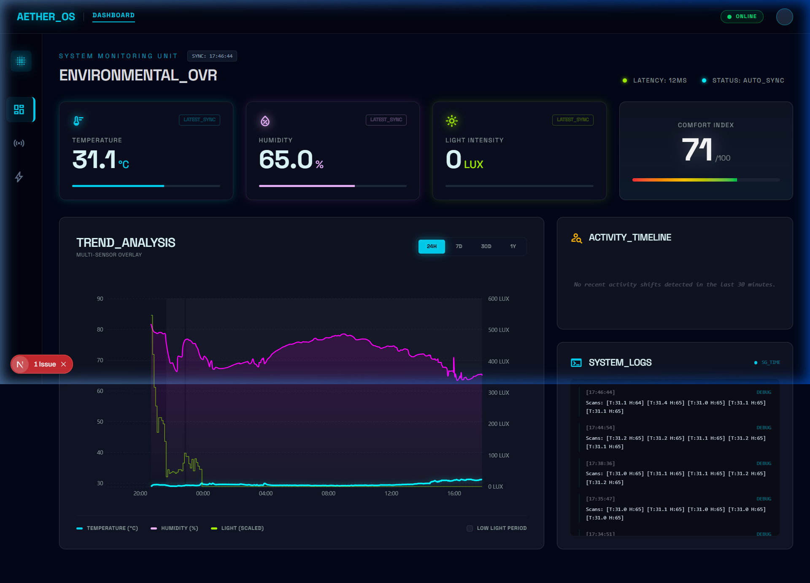

# AETHER_OS: Advanced Environmental Telemetry & Habitability Engine

A high-performance, dual-core embedded system for real-time environmental monitoring and cloud-synchronized data visualization. AETHER_OS leverages the ESP32 architecture to deliver a "Liquid UI" experience alongside robust data telemetry to a Supabase-backed Digital Twin dashboard.

## System Architecture

AETHER_OS utilizes a distributed computing model to ensure UI responsiveness never compromises sensor precision or network reliability.

### Dual-Core Processing Logic
The firmware is partitioned into two distinct execution environments:

1.  **The Painter Core (Core 0)**: Dedicated to the "Liquid UI" engine. It manages high-frequency display updates, mechanical animations (rotating spinners, pulsing icons), and the SSD1306 OLED interface. By isolating the UI on its own core, the interface remains smooth even during blocking network operations.
2.  **The Worker Core (Core 1)**: Handles the heavy-duty telemetry tasks. This includes I2C sensor sampling (BME280/AHT20), WiFi handshaking, NTP time synchronization, and secure HTTP POST requests to the Supabase Edge functions.

## Core Functional Modules

### 1. Environmental Intelligence
The system continuously monitors ambient conditions with high precision.
- **Sensor Fusion**: Multi-stage sampling to filter out transient noise.
- **Meteorological Tracking**: Real-time integration with OpenWeatherMap API to provide local context (Condition, Outside Temp, Humidity).
- **Temporal Engine**: Precision NTP synchronization configured for SGP pools, maintaining a sub-second accurate digital clock.

### 2. Neural Sync (Cloud Integration)
Data is pushed to a high-availability Supabase backend via a RESTful API.
- **Telemetry Bursts**: Samples are packaged into JSON payloads for efficient cloud ingestion.
- **Location Awareness**: Automatic IP-based geolocation to anchor data points to specific geographic regions (Singapore).
- **Status Persistence**: Tracks system health metrics including boot counts and uptime.

### 3. Liquid UI Interface
Designed for the 0.66" OLED display (64x48 resolution), the UI features a "Liquid" state-machine:
- **Main Command**: Interactive menu for selecting active modules.
- **Clock & Weather**: Real-time context powered by NTP and OpenWeatherMap.
- **WiFi Profile Manager**: Scrollable 5-slot manager with `[*]` primary indicator and long-press locking.
- **Mechanical Spinner**: Real-time visual feedback for asynchronous networking tasks.

### 4. Deterministic Networking
The AETHER_OS WiFi stack is engineered for speed and reliability:
- **Strict Primary Logic**: Deterministic targeting of a manually selected "Primary Slot" for sub-second boot-to-sync times.
- **Memory-Link (Fast-Track)**: NVS-backed static IP snapshots and BSSID pinning to bypass DHCP handshakes.
- **Interruptible UX**: Global "Escape Hatch" allows users to abort stalled connection attempts with a single button click.
- **Verbose Diagnostics**: Real-time status reporting for `NO SIGNAL`, `AUTH FAIL`, and `TIMEOUT` events.

## Digital Twin Dashboard

The project includes a full-stack Next.js web application that visualizes telemetry data in a premium, glassmorphism-inspired interface.

### Dashboard Features
- **Real-Time Visualization**: Instant updates as data flows from the hardware.
- **Historical Trending**: Interactive charts showing temperature and humidity fluctuations over time.
- **Responsive Layout**: Optimized for both high-resolution desktop monitors and mobile devices.

## Technical Specifications

- **Hardware**: ESP32 Dual-Core MCU (240MHz)
- **Sensors**: DHT11 (Temp/Hum), MPU6050 (Motion/Tilt)
- **Display**: 0.66" SSD1306 OLED (I2C with 16px offset)
- **Memory Management**: Optimized 12KB Task Stacks to ensure SSL/TLS heap headroom (~40KB+ free).
- **Backend**: Supabase (PostgreSQL + Edge Functions)
- **Frontend**: Next.js 14, Tailwind CSS, Framer Motion
- **Time Sync**: SNTP (pool.ntp.org) with Geo-IP timezone offset.
---

## Getting Started

Ready to build your own AETHER_OS unit? Follow our comprehensive **[Deployment & DIY Guide](DEPLOYMENT.md)** for:
- Full hardware shopping list and wiring schematics.
- Supabase database initialization scripts.
- Firmware configuration and flashing instructions.
- Dashboard deployment on Vercel.

### Quick Start
1. **Clone**: `git clone https://github.com/your-username/AETHER_OS.git`
2. **Backend**: Run `supabase_schema.sql` in your Supabase project.
3. **Configure**: Update `firmware/include/secrets.h` with your credentials.
4. **Flash**: Upload via PlatformIO.
5. **Visualize**: Deploy the `dashboard` to see your data live.

## Development Environment

The firmware is built using the PlatformIO ecosystem within VS Code.
- **Framework**: Arduino
- **Libraries**: Adafruit SSD1306, Adafruit GFX, ArduinoJson, HTTPClient
- **Dashboard**: React-based dashboard with custom glassmorphism styling.
